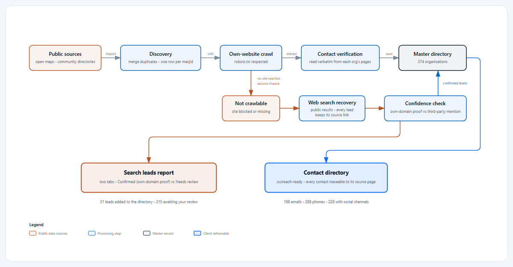
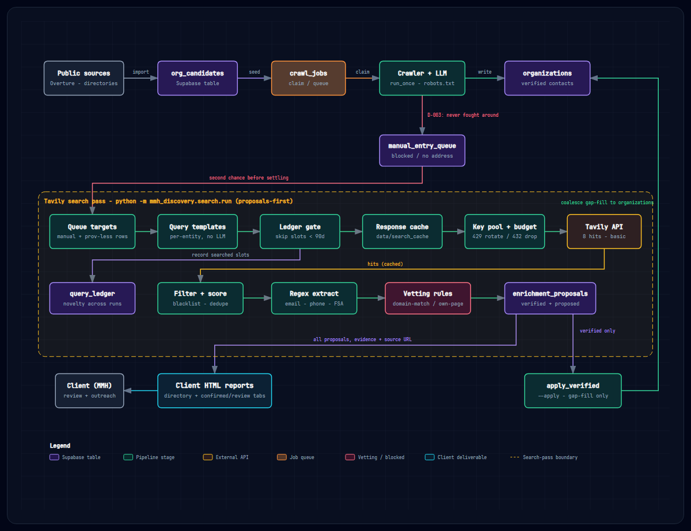

# mmh-discovery-outreach

Discovers Canadian masjids and builds an outreach-ready contact directory for Muslim Media Hub: who they are, where they are, and how to reach them - every contact traceable to the page it came from.

## Data

## Data Collection Pipeline

## Data compliance

- CASL / PIPEDA: business contact information is collected from public pages only; confirm the contact before the first send.
- robots.txt respected on every crawl; rate limits honored.
- No Google Places data and no Meta scraping - both are ToS violations and never used as sources.
- No raw page snapshots retained; every stored value keeps provenance (source URL + fetch record).
